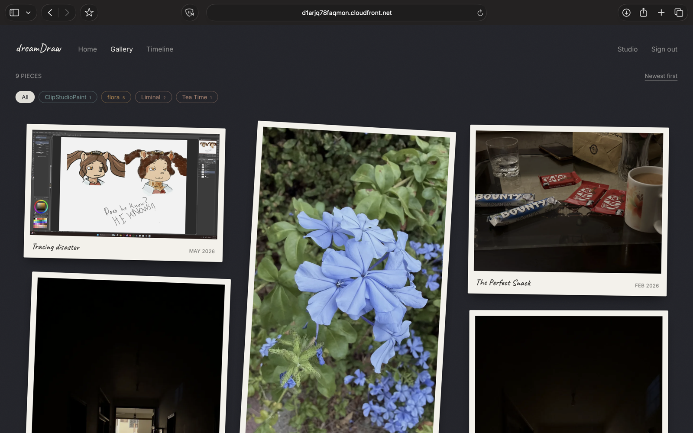
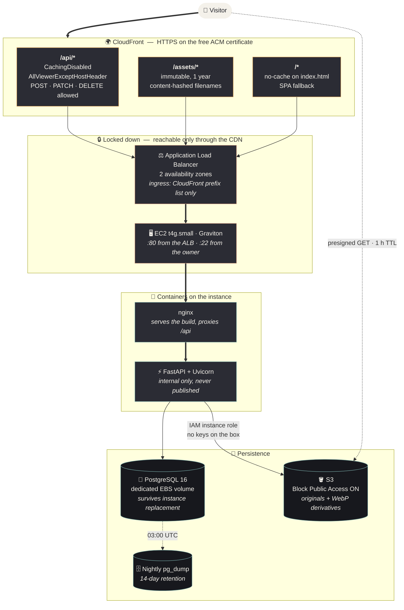
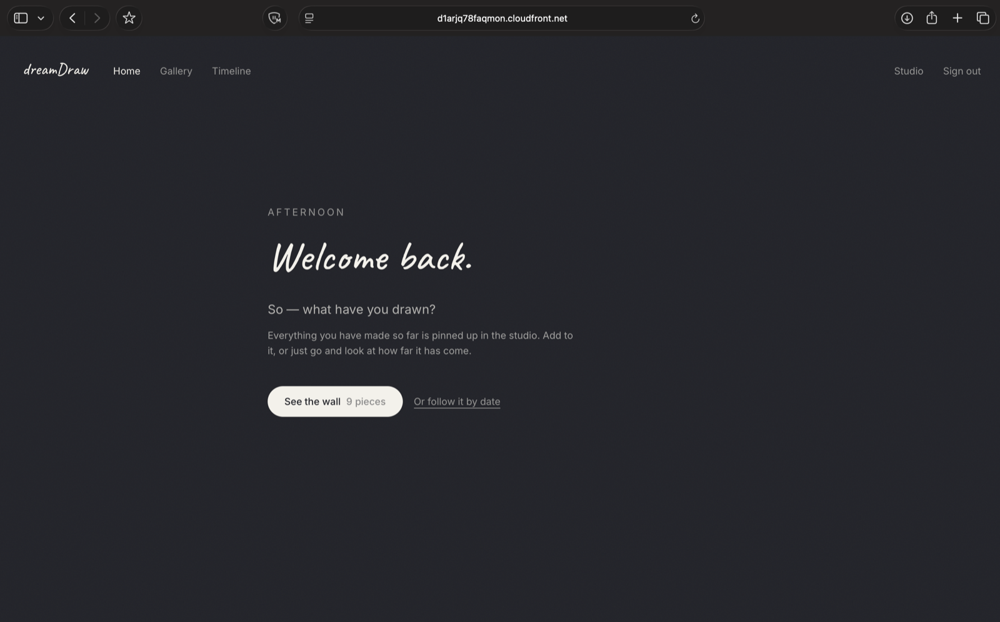
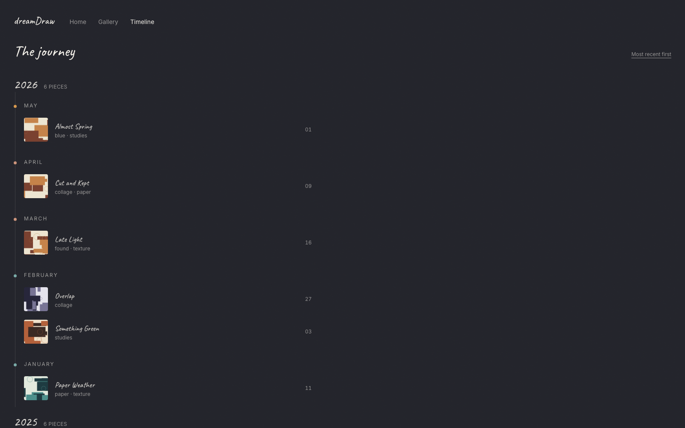
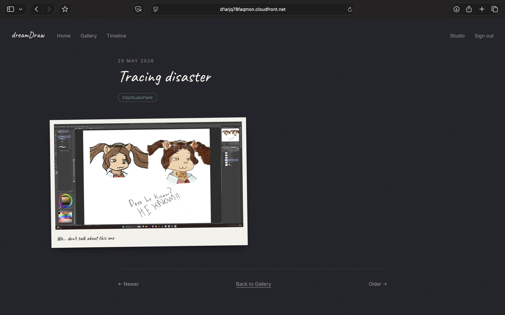
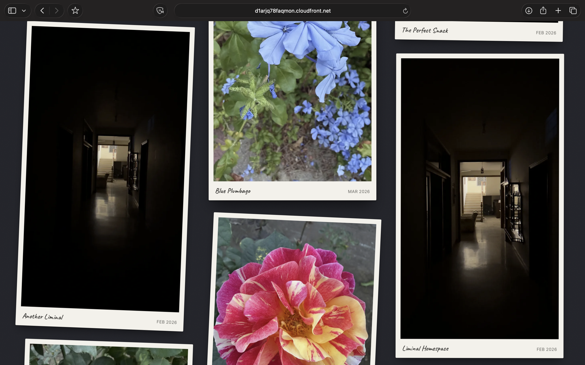
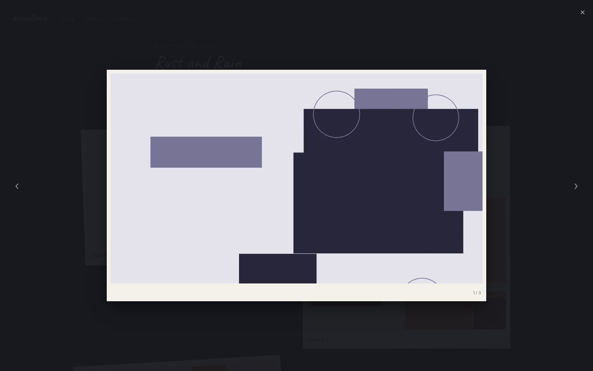
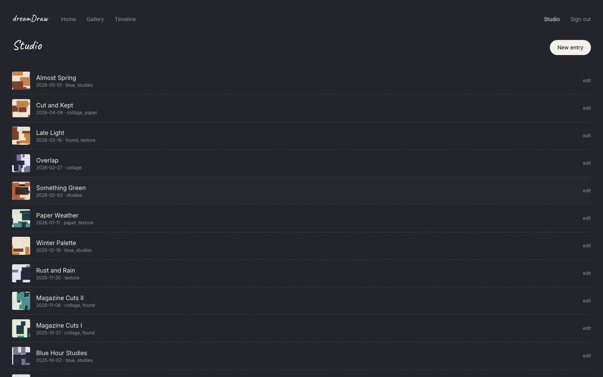

# dreamDraw
<p align="left">
  
  
  
  
  
  
  
  
</p>

## An Art Journey, In Collage

dreamDraw is a personal gallery for documenting an art progression over time. Finished
collage images are uploaded with a title, the date the work was *made*, notes and tags;
visitors browse them as a dark-studio wall of slightly-angled polaroids, or follow the whole
journey as a timeline. One person writes, everyone reads — no accounts, no comments, no
social features. Just the work, in order.

The stack runs in containers on a single EC2 instance behind an Application Load Balancer,
with CloudFront in front for HTTPS. Images live in S3 and reach the browser only through
presigned URLs; the bucket has Block Public Access on and the load balancer is unreachable
except through the CDN.



<sub>Live at <code>d1arjq78faqmon.cloudfront.net</code></sub>

## 🏗️ Architecture Overview



---

### Core Infrastructure
- **CloudFront** — HTTPS on the free `*.cloudfront.net` certificate, no domain purchase
- **Application Load Balancer** — across two availability zones
- **EC2 `t4g.small`** — Graviton/ARM, ~20% cheaper than the x86 equivalent
- **EBS** — 8 GB root plus a dedicated 20 GB data volume for Postgres
- **S3** — image objects with server-side derivative generation
- **IAM instance role** — scoped to one bucket; no long-lived keys exist on the instance

### Application
- **Masonry gallery** — polaroid cards with a stable hashed tilt, infinite scroll, tag filter
- **Timeline** — entries grouped by month and year with an accent rail
- **Lightbox** — keyboard navigation, touch swipe, focus trapped and restored
- **Studio** — password-gated admin: entry editor, drag-and-drop uploader with per-file
  progress, image reordering, alt text, cover selection

### Image Pipeline
- **Magic-byte validation** — a PDF renamed `.jpg` is rejected; the declared type is a hint
- **HEIC accepted** — phones shoot it by default, so photos import without conversion
- **Derivatives** — `thumb` 400px and `medium` 1400px, WebP quality 82, never upscaled
- **EXIF** — orientation applied *then* stripped, so rotation survives while GPS does not

## 📸 Screenshots

| | |
|---|---|
|  |  |
| **Home** — a greeting and a way in | **Timeline** — grouped by month and year, with an accent rail |
|  |  |
| **Entry** — the work, its notes and its tags | **The wall** — masonry, each card tilted by a hash of its id |
|  |  |
| **Lightbox** — the polaroid straightens and scales up; arrow keys and swipe navigate | **Studio** — the private side: everything made so far, and a way in to edit it |

## 📁 Project Structure

```
dreamDraw
├── backend/
│   ├── app/
│   │   ├── main.py                  # FastAPI app, router registration
│   │   ├── config.py                # pydantic-settings; every env var
│   │   ├── db.py                    # async engine + session dependency
│   │   ├── deps.py                  # auth guard, client IP resolution
│   │   ├── models/                  # SQLAlchemy: entries, images, tags
│   │   ├── schemas/                 # Pydantic request/response models
│   │   ├── routers/                 # auth, entries, images, tags, health
│   │   └── services/                # images (Pillow), storage (S3), slugs
│   ├── alembic/                     # migrations; no create_all anywhere
│   └── requirements.txt
├── frontend/
│   └── src/
│       ├── api/                     # typed fetch client + response types
│       ├── components/              # Polaroid, Masonry, Lightbox, TagChip
│       ├── routes/                  # Home, Gallery, Timeline, EntryDetail
│       │   └── admin/               # Login, Studio, EntryForm
│       └── theme/rotation.ts        # hashed tilt + per-tag accent
├── infra/
│   ├── Dockerfile.api               # python:3.12-slim, runs as nobody
│   ├── Dockerfile.web               # node build -> nginx:alpine
│   ├── nginx.conf                   # SPA fallback, /api proxy, cache headers
│   ├── docker-compose.yml           # web + api + db
│   ├── docker-compose.dev.yml       # local overlay: mounts AWS credentials
│   └── aws/
│       ├── deploy.sh                # rsync + rebuild + assert health
│       ├── park.sh                  # stop the meter, keep the data
│       ├── bringup.sh               # rebuild the ALB, repoint CloudFront
│       ├── teardown.sh              # delete everything (dry run by default)
│       ├── costcheck.sh             # what is billing right now
│       ├── backup.sh                # nightly pg_dump to S3
│       └── user-data.sh             # instance bootstrap
├── utils/                           # screenshots for this README
└── .env.example                     # every variable, documented
```

## ⚙️ Configuration

Copy `.env.example` to `.env` and fill it in. Nothing is read from anywhere else.

| Variable | Description | Default | Required |
|----------|-------------|---------|----------|
| `ADMIN_PASSWORD_HASH` | bcrypt hash of the admin password — **not** the password | — | Yes |
| `JWT_SECRET` | Signing key for session tokens (`openssl rand -hex 32`) | — | Yes |
| `S3_BUCKET` | Bucket holding images and backups | — | Yes |
| `AWS_REGION` | Must match where the bucket lives | `us-east-1` | Yes |
| `ENV` | `dev` enables `/api/docs` and CORS; use `prod` live | `dev` | No |
| `SESSION_COOKIE_SECURE` | **`true` in production** — see below | `false` | No |
| `POSTGRES_DATA` | Host path for the database | `./pgdata` | No |
| `WEB_PORT` | Host port nginx publishes on | `8080` | No |
| `S3_ENDPOINT_URL` | Point boto3 at MinIO for local work | *(empty)* | No |

> [!WARNING]
> **Escape every `$` in `ADMIN_PASSWORD_HASH` as `$$`.** `docker compose` treats `$NAME` in an
> env file as a variable and substitutes it away, silently truncating a bcrypt hash so that
> every login fails while the app otherwise looks perfectly healthy. The API refuses to start
> if the hash arrives malformed, so this fails loudly rather than at 2am.

## 🚀 Running It

### Locally, the whole stack

```bash
cp .env.example .env
docker compose -f infra/docker-compose.yml -f infra/docker-compose.dev.yml up --build
```

nginx on `http://localhost:8080`. The dev overlay exists only to pass your AWS credentials
through to the API; on the instance the IAM role supplies them, so deployment uses the base
file alone.

### Working on the frontend

Compose serves a production build and will not hot-reload. For frontend work run Vite against
the API — it proxies `/api` through, so the session cookie behaves exactly as it does behind
CloudFront:

```bash
cd frontend && npm run dev      # http://localhost:5173
```

### Database changes

Schema is managed entirely by Alembic. There is no `create_all` anywhere, so a model edit
without a migration simply will not take effect.

```bash
alembic revision --autogenerate -m "what changed"
alembic upgrade head
```

Read what autogenerate produces before applying it. It does not always get circular foreign
keys right — see the comment in `0001_initial_schema.py`, where the generated output was
silently missing a constraint.

## ☁️ Deployment

There is no CI. Deployment is one script that rsyncs the working tree and rebuilds.

```bash
./infra/aws/deploy.sh      # push code, rebuild, migrate, assert health
./infra/aws/costcheck.sh   # what is currently billing
```

`deploy.sh` asserts two things afterwards that have both silently broken before: that Postgres
is on the EBS volume rather than the root disk, and that nginx is published on port 80 where
the ALB expects it. Both stem from `docker compose` resolving `${VAR}` against a `.env` beside
the *compose file* rather than the working directory — which is why every invocation passes
`--env-file`.

### Parking it between sessions

The load balancer cannot be stopped, only deleted, and it is half the bill.

```bash
./infra/aws/park.sh        # -> ~$2.70/month, keeps database and images
./infra/aws/bringup.sh     # -> back up in ~10 minutes
```

A rebuilt ALB always gets a new DNS name, so `bringup.sh` repoints the CloudFront origin and
waits for it to propagate. The instance also gets a new public IP on every start, and the
script rewrites `infra/aws/resources.env` so `deploy.sh` keeps working.

### Backups

A nightly `pg_dump` goes to `s3://<bucket>/backups/` at 03:00 UTC, kept for 14 days. The
database otherwise lives on a single EBS volume with no snapshots, and `teardown.sh` deletes
that volume — the dump is the backstop for exactly that mistake.

```bash
aws s3 cp s3://<bucket>/backups/<file>.sql.gz - | gunzip | \
  docker compose --env-file .env -f infra/docker-compose.yml exec -T db psql -U dreamdraw dreamdraw
```

## 🔒 Security

| Layer | Control |
|---|---|
| **Transport** | HTTPS via CloudFront; HTTP redirects; `Secure` `httpOnly` `SameSite=Lax` cookie |
| **Load balancer** | Ingress restricted to the `com.amazonaws.global.cloudfront.origin-facing` prefix list — the ALB DNS name times out from anywhere else |
| **Instance** | `:80` from the ALB security group only; `:22` from the owner's IP only; IMDSv2 required |
| **Storage** | S3 Block Public Access on all four settings; AES256 at rest; presigned GET with a 1-hour TTL |
| **Credentials** | IAM instance role scoped to one bucket; no long-lived keys on the instance or in the repo |
| **Auth** | Single bcrypt-hashed password; every mutating endpoint returns 401 without a session |
| **Rate limiting** | 5 failed logins per 15 minutes per IP; a correct password does not bypass an active block |
| **Uploads** | Magic-byte validation, 25 MB cap, UUID-derived S3 keys, EXIF and GPS stripped from derivatives |

The lockdown is the point of the ALB, not availability — see the note at the end.

## 💰 Cost

Roughly **$36.57/month** if left running, about $1.20/day:

| Resource | Monthly |
|---|---|
| Application Load Balancer | $18.40 — billed hourly whether or not anyone visits |
| EC2 `t4g.small` | $15.48 |
| EBS, 28 GB total | $2.69 |
| CloudFront, S3 | effectively free at this volume |

Parked, it drops to about **$2.70/month** — the EBS volumes alone. A $60 budget alarm emails
at 80% actual and 100% forecast.

## 🧹 Teardown

**Order matters, and things bill until explicitly deleted.** A volume detached from a
terminated instance is the classic forgotten charge: it bills quietly and nothing reminds you.

```bash
./infra/aws/teardown.sh          # dry run, prints what it would delete
./infra/aws/teardown.sh --yes    # actually delete
```

1. **CloudFront** — disable, wait for it to deploy, then delete. AWS refuses to delete an
   enabled distribution, and the wait is 5–15 minutes
2. **ALB**, then the target group — the group cannot go while a listener still holds it
3. **EC2 instance**, waiting for termination; volumes cannot be deleted before it is gone
4. **EBS volumes**, plus a sweep for *any* unattached volume left behind
5. **Security groups**, once their network interfaces have detached

Deliberately **not** deleted: the S3 bucket, IAM role, key pair and budget alarm. The bucket
holds your images *and* your database backups, so emptying it is a decision made on purpose.

Afterwards `costcheck.sh` should report zeroes. It calls out unattached volumes, idle elastic
IPs and NAT gateways specifically, because those are the three that bill silently.

## 🎯 Notes On The Build

### Accessibility
- ✅ Every text style measured against the canvas and meeting WCAG AA
- ✅ Keyboard path from gallery into the lightbox and back out, focus restored to the trigger
- ✅ Visible focus rings, alt text on every image, one `h1` per page, landmark regions
- ✅ `prefers-reduced-motion` flattens the polaroid tilt and collapses transitions
- ✅ Image reordering uses buttons, not drag handles — native HTML5 drag is unusable with a
  keyboard or a screen reader

### Failure behaviour
- ✅ A server outage never renders as an empty gallery: "could not load" and "nothing here yet"
  are different screens, with a retry
- ✅ One bad file in a drop of twenty does not lose the other nineteen
- ✅ Deleting an entry removes its S3 objects; the database cascade alone would orphan them
- ✅ Crashes get their own page rather than masquerading as a 404

### Deliberate constraints
- ✅ Single admin password, no user accounts — the scope is one person's gallery
- ✅ One uvicorn worker: the rate limiter counts in process memory
- ✅ No CI/CD — not worth the setup for a one-month lifetime
- ✅ Alembic migration for every schema change

## A note on the architecture

A single EC2 instance behind a load balancer is not a high-availability setup, and is not
meant to look like one. The ALB is there because it sits cleanly behind CloudFront and lets
the instance's security group be locked to the CloudFront origin-facing prefix list, so the
site is reachable only over HTTPS through the CDN. If the instance goes down, the site goes
down.

This is expected to run for about a month and then be torn down. Decisions throughout favour
"simple enough to finish and delete" over "durable".
